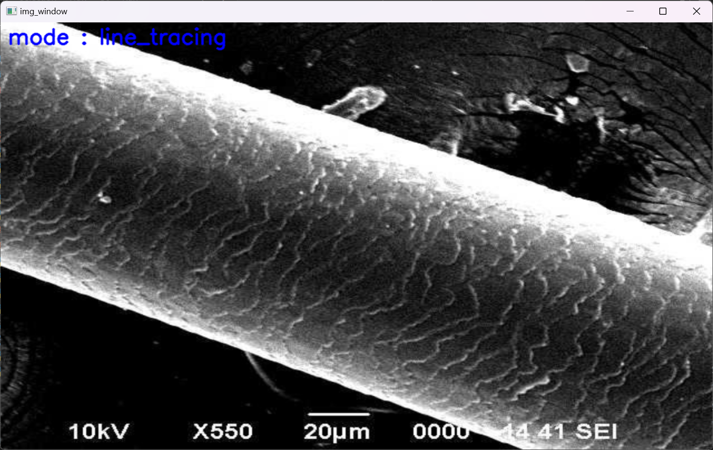
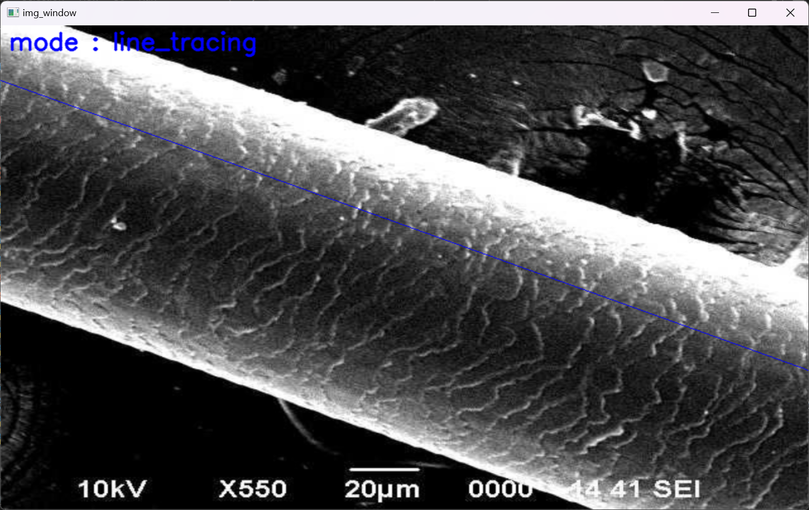
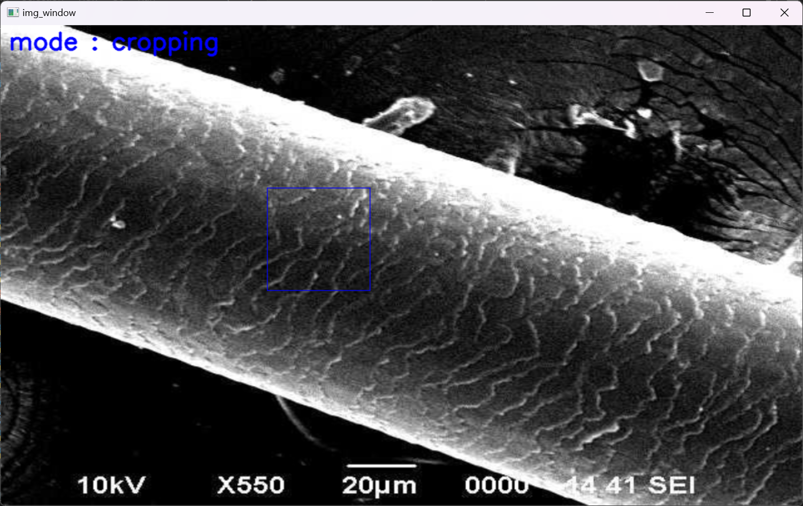

# HairSEM
Analyze hair status with SEM. Quantify cuticle offset from a SEM image.

## Running the program
1. Clone this project
```bash
git clone https://github.com/dolphin2410/hairSEM
```
2. Run `main.py`
```bash
python main.py
```

## Using the program
When you initially run this program, the following window will appear



You can click on two different points on the image to form a line. Then it will look like this.



Press `a` on the keyboard to analyze the amount of damage. In the terminal, four numbers will be shown. Each corresponds to the `S.SE`, `n_chunks`, `n_pixels` and `standard deviation`

## Advanced uses
You can crop your own image to form your own dataset. From the main window, press `m` to change the mode from `line-tracing` to `crop`. If you press `s`, it will automatically create 500 samples of 128x128 images cropped from your image. Otherwise, click on any point of the window. Then a blue square will be shown. If you press `s`, it will create a single sample of the 128x128 image inside the border of the square drawn on the window.

